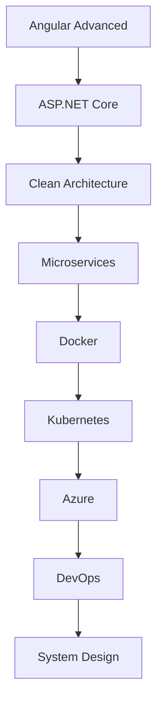

<!-- ===================================================== -->
<!--                  ANIMATED HEADER                       -->
<!-- ===================================================== -->

<div align="center">


</div>

---

<!-- ===================================================== -->
<!--                      HERO BANNER                       -->
<!-- ===================================================== -->

<div align="center">


</div>

---

<!-- ===================================================== -->
<!--                   PROFILE BADGES                       -->
<!-- ===================================================== -->

<div align="center">


</div>

---

# 💫 About Me

```java
public class BitanKarmakar {

    String role = "Full Stack Developer";

    String education = "Computer Science Student";

    String company = "National Informatics Centre (NIC), Howrah";

    String previousInternship = "Ardent Computech";

    String[] interests = {

        "Angular",

        "ASP.NET Core",

        "Spring Boot",

        "Cybersecurity",

        "REST APIs",

        "API Security",

        "Clean Architecture",

        "PostgreSQL"

    };

    String motto = "Learn • Build • Secure • Repeat";

}
```

---

# 🚀 Who Am I?


🎓 Computer Science Student passionate about building scalable applications.

💼 Currently working as a **Full Stack Developer Intern** at **National Informatics Centre (NIC), Howrah**.

🔐 Former **Cybersecurity Intern** at **Ardent Computech**.

⚙️ Building enterprise applications using Angular + ASP.NET Core + PostgreSQL.

🌱 Learning Microservices, Clean Architecture, Docker and DevOps.

💡 Interested in Secure Software Development.

🎯 Goal: Become a Software Engineer capable of building secure enterprise-scale applications.

⚡ Fun Fact:

> I love solving backend problems more than frontend bugs 😄

---

# 💼 Experience

## 🏛 National Informatics Centre (NIC)

**Full Stack Developer Intern**

📅 July 2026 — Present

### Working With

- Angular

- ASP.NET Core

- PostgreSQL

- Entity Framework Core

- REST APIs

- Git

- JWT Authentication

- MVC Architecture

- Enterprise Software Development

---

## 🔐 Ardent Computech

**Cybersecurity Intern**

📅 June 2026

Worked On

✔ Ethical Hacking

✔ Vulnerability Assessment

✔ Network Security

✔ API Security

✔ Penetration Testing

✔ Information Security

✔ Secure Coding Practices

---

# 🎯 Current Focus

```text
🌱 Learning ASP.NET Core Advanced

🌱 Angular Architecture

🌱 Spring Boot Security

🌱 Docker

🌱 Clean Architecture

🌱 Design Patterns

🌱 PostgreSQL Optimization

🌱 JWT Authentication

🌱 OWASP Top 10

🌱 API Security

🌱 DevOps

🌱 System Design
```

---

# 🧠 Developer Philosophy

<div align="center">

> **"Every project teaches something new. Every bug makes you a better developer."**

</div>

---

<div align="center">

## 🚀 "Code. Learn. Build. Secure."

</div>


<!-- ===================================================== -->
<!--                  TECH STACK SECTION                    -->
<!-- ===================================================== -->

# 🛠️ Tech Arsenal

<div align="center">

## 💻 Programming Languages

<p>


</p>

---

## 🎨 Frontend Development

<p>


</p>

---

## ⚙️ Backend Development

<p>


</p>

---

## 🗄️ Databases

<p>


</p>

---

## ☁️ Cloud & DevOps

<p>


</p>

---

## 🔐 Cybersecurity

<p>


</p>

---

## 🧰 Development Tools

<p>


</p>

---

# 📚 Currently Learning

<div align="center">

| 🚀 Technology | 📈 Progress |
|--------------|------------|
| ASP.NET Core Advanced | 🟩🟩🟩🟩🟩🟩🟩⬜⬜⬜ 70% |
| Angular Advanced | 🟩🟩🟩🟩🟩🟩🟩🟩⬜⬜ 80% |
| Spring Boot Security | 🟩🟩🟩🟩🟩🟩⬜⬜⬜⬜ 60% |
| PostgreSQL | 🟩🟩🟩🟩🟩🟩🟩🟩⬜⬜ 80% |
| Docker | 🟩🟩🟩🟩🟩⬜⬜⬜⬜⬜ 50% |
| Kubernetes | 🟩🟩🟩⬜⬜⬜⬜⬜⬜⬜ 30% |
| Microservices | 🟩🟩🟩🟩⬜⬜⬜⬜⬜⬜ 40% |
| System Design | 🟩🟩🟩🟩🟩⬜⬜⬜⬜⬜ 50% |

</div>

---

# 🚀 Areas of Interest

```text
💻 Full Stack Development

⚙ Enterprise Software Development

🔐 Cybersecurity

🛡 Secure API Development

🌐 RESTful Web Services

🏗 Clean Architecture

📦 Microservices

☁ Cloud Computing

🐳 Docker

🗄 Database Optimization

🧠 Problem Solving

🚀 Open Source
```

---

# 📌 Core Skills

<div align="center">

| 💡 Domain | ⚡ Skills |
|-----------|-----------|
| Frontend | Angular, HTML, CSS, Bootstrap, TypeScript |
| Backend | ASP.NET Core, Spring Boot, REST APIs |
| Database | PostgreSQL, MySQL, MongoDB |
| Security | JWT, Authentication, OWASP, API Security |
| Tools | Git, GitHub, VS Code, Postman |
| Soft Skills | Teamwork, Problem Solving, Continuous Learning |

</div>

---

<div align="center">

### ⚡ "Technology is best when it brings people together."

</div>


<!-- ===================================================== -->
<!--             GITHUB ANALYTICS SECTION                  -->
<!-- ===================================================== -->

# 📊 GitHub Analytics

<div align="center">


</div>

---

# 🔥 GitHub Streak

<div align="center">


</div>

---

# 📈 Contribution Graph

<div align="center">


</div>

---

# 🏆 GitHub Trophies

<div align="center">


</div>

---

# ⚡ GitHub Summary Cards

<div align="center">


</div>

<br>

<div align="center">


</div>

---

# 📈 Developer Statistics

<div align="center">

| Metric | Value |
|--------|-------|
| 💻 Full Stack Projects | 🚀 Growing |
| 🔐 Cybersecurity Projects | 🚀 Growing |
| 🌱 Currently Learning | Angular, ASP.NET Core, Spring Boot |
| 💼 Current Role | Full Stack Developer Intern |
| 🎯 Goal | Software Engineer |
| 📚 Daily Learning | Yes ✅ |

</div>

---

# 🧠 Coding Philosophy

<div align="center">

> **"Great software isn't just about making it work—it's about making it secure, maintainable, and scalable."**

</div>

---

# 🚀 2026 Goals

- ✅ Master Angular
- ✅ Become Advanced in ASP.NET Core
- ✅ Build Enterprise-Level Applications
- ✅ Learn Microservices
- ✅ Learn Docker & Kubernetes
- ✅ Contribute to Open Source
- ✅ Improve DSA & Problem Solving
- ✅ Deepen Cybersecurity Knowledge
- ✅ Build a Professional Portfolio
- ✅ Secure a Software Engineer Role

---

# 📅 Development Timeline

```text
2024
│
├── Started Full Stack Development
│
├── Learned HTML, CSS & JavaScript
│
└── Started Programming Journey
│

2025
│
├── Learned Java
├── Learned Spring Boot
├── PostgreSQL
├── Angular
├── ASP.NET Core
└── Git & GitHub
│

2026
│
├── Cybersecurity Internship @ Ardent
├── Full Stack Internship @ NIC
├── Enterprise Development
├── JWT Authentication
├── REST APIs
└── Clean Architecture
│

2027 (Goal)
│
├── Software Engineer
├── Cloud Computing
├── DevOps
├── Kubernetes
└── Open Source Contributor
```

---

# 💻 Daily Workflow

```text
☀️ Morning

☕ Coffee
↓

📚 Study New Concepts
↓

💻 Development
↓

🐛 Debugging
↓

🧪 Testing
↓

📖 Documentation
↓

🌙 Learn Something New
```

---

# 📌 Fun Developer Facts

- 💡 I enjoy solving backend challenges.
- 🔐 Passionate about cybersecurity and secure coding.
- ⚙️ I love building REST APIs.
- 📚 Every day is a learning opportunity.
- 🚀 My goal is to create scalable enterprise applications.
- 🌍 Always open to collaborating on exciting projects.

---

<div align="center">

### ⭐ If you like my work, don't forget to star my repositories!


</div>

<!-- ===================================================== -->
<!--              FEATURED PROJECTS SECTION                 -->
<!-- ===================================================== -->

# 🚀 Featured Projects

<div align="center">

## 📚 3D Library Website

> 🌟 **Interactive Digital Library Platform**

**Features**

- 📖 3D Interactive UI
- 🔐 User Authentication
- 📚 Book Management
- 🔍 Search Functionality
- 📱 Responsive Design

**Tech Stack**

`Angular` • `.NET Core` • `PostgreSQL` • `Three.js`

---

## 🧮 Calculator

> 🌟 **Responsive Web Calculator**

**Features**

- ➕ Basic Arithmetic Operations
- ⚡ Fast Calculations
- 📱 Responsive Design
- 🎨 Clean UI

**Tech Stack**

`HTML` • `CSS` • `JavaScript`

---

## ❌⭕ Tic-Tac-Toe

> 🌟 **Classic Multiplayer Game**

**Features**

- 🎮 Interactive Gameplay
- 🏆 Winner Detection
- 🔄 Restart Game
- 📱 Responsive Interface

**Tech Stack**

`HTML` • `CSS` • `JavaScript`

</div>

---

# 💼 Experience

## 🏛 National Informatics Centre (NIC), Howrah

### Full Stack Developer Intern

**July 2026 – Present**

### Responsibilities

- Developing enterprise-level web applications
- Building REST APIs
- Angular frontend development
- ASP.NET Core backend development
- PostgreSQL database management
- Bug fixing & optimization
- Working with Git and version control
- Learning enterprise software architecture

---

## 🔐 Ardent Computech

### Cybersecurity Intern

**June 2026**

Worked on

- Ethical Hacking
- Vulnerability Assessment
- Penetration Testing
- Network Security
- API Security
- Secure Coding
- Security Testing

---

# 🎓 Education

```text
Bachelor of Technology

Computer Science & Engineering

Passionate about

✔ Software Engineering

✔ Full Stack Development

✔ Cybersecurity

✔ Cloud Computing

✔ Secure Software Development
```

---

# 🏆 Certifications

- 🎖 Cybersecurity Internship Certificate
- 🎖 Full Stack Development Internship (NIC)
- 🎖 REST API Development
- 🎖 Angular Development *(add as you earn them)*
- 🎖 ASP.NET Core *(add as you earn them)*

---

# 🧠 Current Learning Roadmap



---

# 🌐 Coding Profiles

<div align="center">

[](https://github.com/Codelearner236)

[](YOUR_LINKEDIN)

[]()

[]()

[]()

</div>

---

# 📫 Connect With Me

<div align="center">

### Let's build something amazing together!

💼 Full Stack Developer

🔐 Cybersecurity Enthusiast

🚀 Open Source Learner

📚 Lifelong Student

</div>

---

# 📈 2026 Goals

- 🚀 Master Angular
- 🚀 Become Advanced in ASP.NET Core
- 🚀 Learn Microservices
- 🚀 Learn Docker
- 🚀 Learn Kubernetes
- 🚀 Learn Azure
- 🚀 Build Enterprise Projects
- 🚀 Contribute to Open Source
- 🚀 Improve DSA
- 🚀 Become Software Engineer

---

# 💡 Favorite Quote

<div align="center">

> **"Success is built one commit at a time."**

</div>

---

# ⚡ Random Dev Quote

<div align="center">


</div>

---

# 🐍 Contribution Snake

> Enable this after creating your repository.

```yaml
name: Generate Snake

on:
  schedule:
    - cron: "0 */12 * * *"

jobs:
  build:

    runs-on: ubuntu-latest

    steps:

      - uses: Platane/snk@v3

        with:

          github_user_name: Codelearner236

          outputs: |
            dist/github-contribution-grid-snake.svg

      - uses: crazy-max/ghaction-github-pages@v4

        with:

          target_branch: output

          build_dir: dist

        env:

          GITHUB_TOKEN: ${{ secrets.GITHUB_TOKEN }}
```

Then display it with:

```markdown
<p align="center">

</p>
```

---

# ❤️ Support

If you enjoy my work, please consider:

⭐ Starring my repositories

🍴 Forking projects

🤝 Collaborating on Open Source

💬 Sharing feedback

---

<div align="center">

# Thanks for Visiting 👋


### ⭐ Happy Coding! ⭐

</div>
